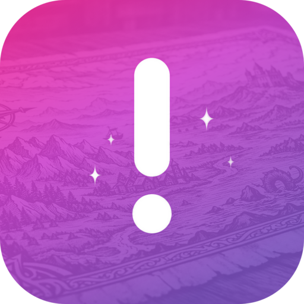

  

<h1 align="center">Welcome to Sidequest</h1>

Your **main quest** is always running. But every great adventure needs sidequests — parallel agent sessions that **tackle bugs, ship features, prototype ideas, and research solutions** to keep your story moving forward.

## Install on macOS

1. Go to the [latest release](https://github.com/zieka/get-sidequest/releases/latest)
2. Download the `.dmg` file
3. Open the `.dmg` and drag **Sidequest** into your Applications folder
