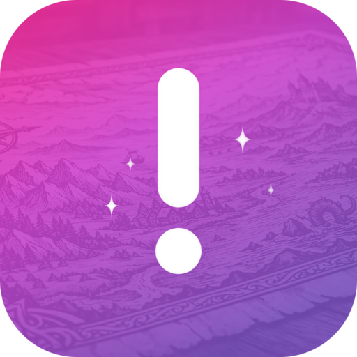

  

<h1 align="center">Sidequest</h1>

  Your AI development team, orchestrated.

  <a href="https://zieka.github.io/get-sidequest/">Website</a> &bull;
  <a href="https://zieka.github.io/get-sidequest/docs/">Documentation</a> &bull;
  <a href="https://github.com/zieka/get-sidequest/releases/latest">Download</a>

---

Run parallel Claude Code agents, supervise them automatically, and ship faster than ever.

## Install on macOS

1. Go to the [latest release](https://github.com/zieka/get-sidequest/releases/latest)
2. Download the `.dmg` file
3. Open the `.dmg` and drag **Sidequest** into your Applications folder
